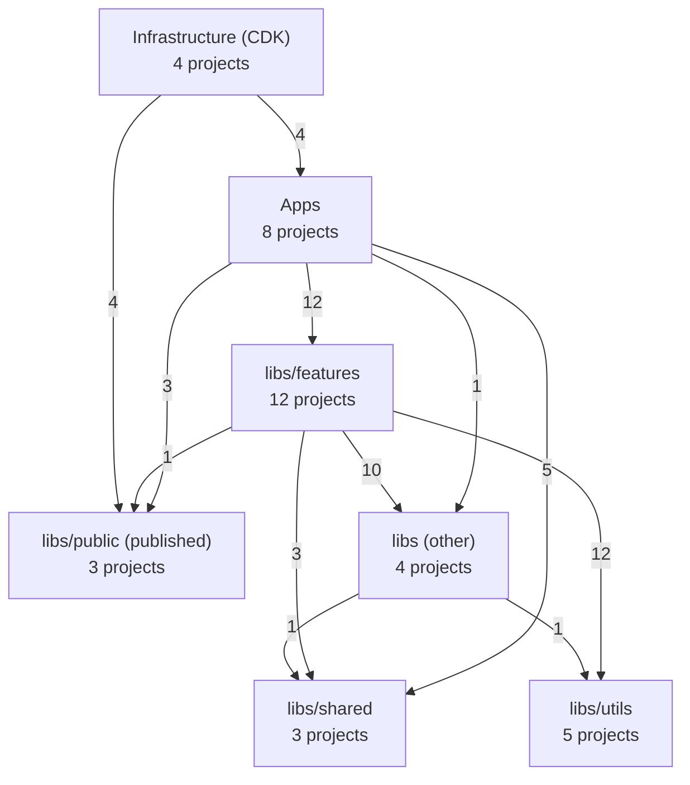
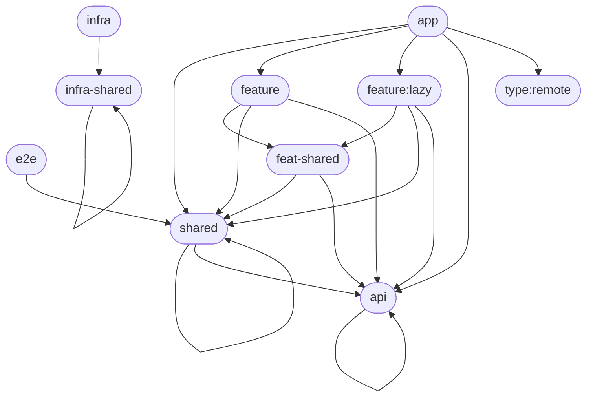
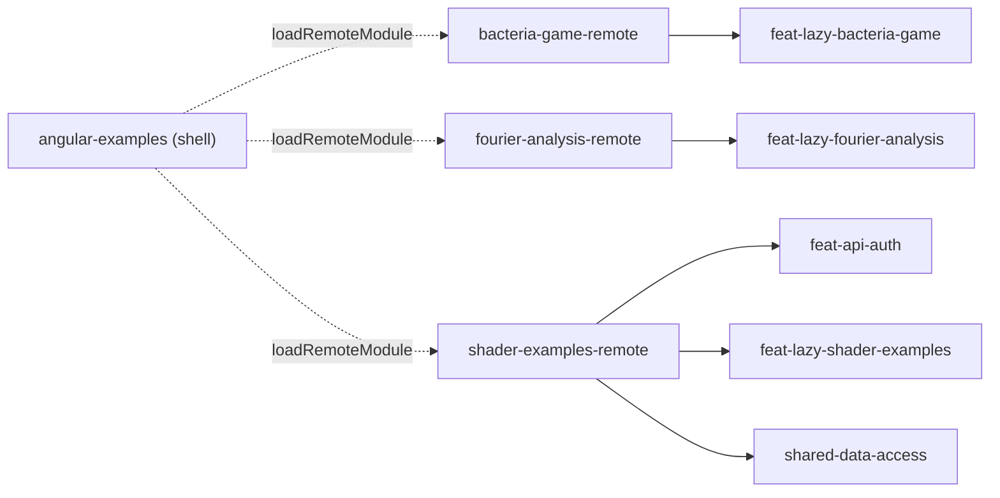
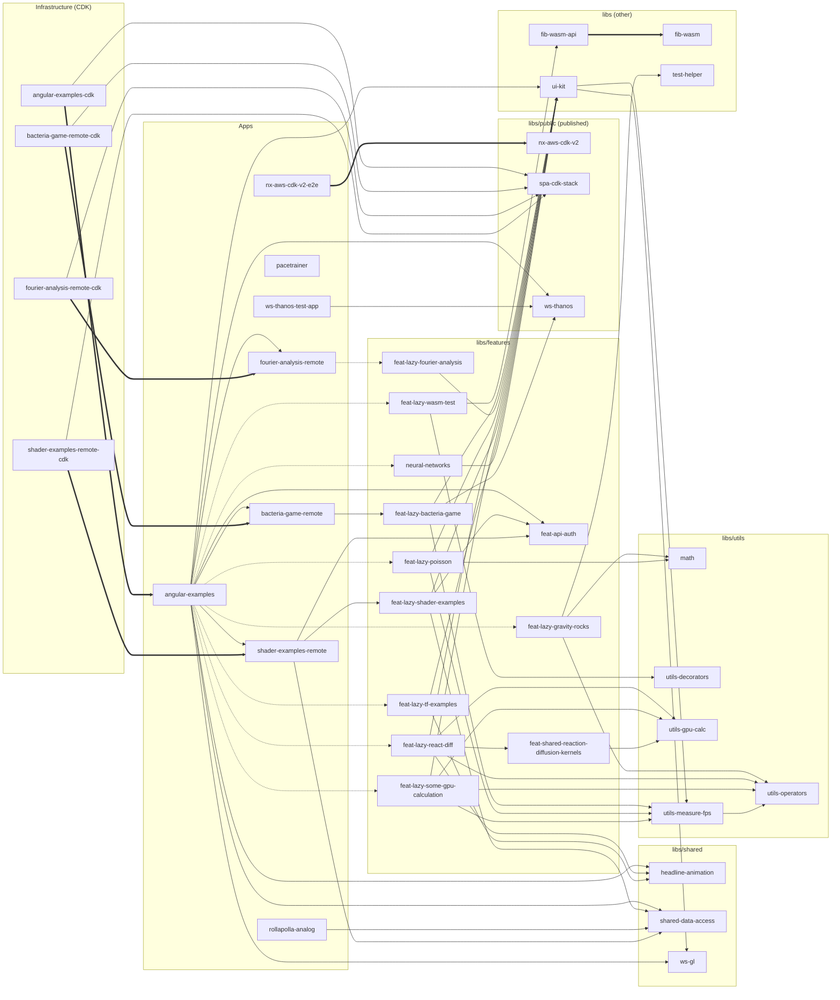

<!-- Generated by tools/architecture/generate-diagrams.mjs. Do not edit by hand: run `npm run arch:diagrams`. -->

# Architecture Diagrams

Generated from the Nx project graph, the module boundary rules in
`.oxlintrc.json` and the Native Federation manifest. Regenerated every week by
the architecture routine; for the narrative overview see
[`docs/ARCHITECTURE.md`](../ARCHITECTURE.md).

**39 projects · 64 internal dependencies · 3 federated remotes**

## Contents

- [Layer overview](#layer-overview)
- [Allowed dependencies (module boundaries)](#allowed-dependencies-module-boundaries)
- [Module Federation topology](#module-federation-topology)
- [Project dependency graph](#project-dependency-graph)
- [Modularity metrics](#modularity-metrics)
- [Automated findings](#automated-findings)

## Layer overview

Dependencies between project groups (edge label = number of project-level
dependencies).

## Allowed dependencies (module boundaries)

Tag rules enforced by `@nx/enforce-module-boundaries`. An arrow means
"projects tagged A may depend on projects tagged B". A tag may only depend on itself where its
own rule lists it (drawn as a self-loop).

## Module Federation topology

## Project dependency graph

Solid arrows are static imports, dotted arrows are lazy (dynamic) imports and
thick arrows are implicit dependencies from `project.json` (e.g. a CDK stack
deploying an app). npm packages are not shown.

## Modularity metrics

- **Fan-in (Ca)**: projects that depend on this one.
- **Fan-out (Ce)**: projects this one depends on.
- **Instability** = Ce / (Ca + Ce). Stable, widely used libraries should sit
  near 0; apps near 1. A library with high instability _and_ high fan-in is a
  change magnet.

| Project                                  | Group    | Tags                                    | Fan-in (Ca) | Fan-out (Ce) | Instability |
| ---------------------------------------- | -------- | --------------------------------------- | ----------- | ------------ | ----------- |
| `angular-examples`                       | apps     | app, type:host                          | 1           | 16           | 0.94        |
| `ui-kit`                                 | other    | shared, ui                              | 9           | 2            | 0.18        |
| `feat-lazy-react-diff`                   | features | feature:lazy                            | 1           | 5            | 0.83        |
| `feat-lazy-some-gpu-calculation`         | features | feature:lazy                            | 1           | 4            | 0.8         |
| `shader-examples-remote`                 | apps     | app, scope:shader-examples, type:remote | 2           | 3            | 0.6         |
| `utils-measure-fps`                      | utils    | shared                                  | 4           | 1            | 0.2         |
| `feat-lazy-bacteria-game`                | features | feature:lazy                            | 1           | 3            | 0.75        |
| `feat-lazy-gravity-rocks`                | features | feature:lazy                            | 1           | 3            | 0.75        |
| `feat-lazy-poisson`                      | features | feature:lazy                            | 1           | 3            | 0.75        |
| `feat-lazy-shader-examples`              | features | feature:lazy                            | 1           | 3            | 0.75        |
| `shared-data-access`                     | shared   | shared                                  | 4           | 0            | 0           |
| `spa-cdk-stack`                          | public   | infra-shared, published                 | 4           | 0            | 0           |
| `utils-operators`                        | utils    | shared                                  | 4           | 0            | 0           |
| `bacteria-game-remote`                   | apps     | app, type:remote                        | 2           | 1            | 0.33        |
| `feat-api-auth`                          | features | api                                     | 3           | 0            | 0           |
| `feat-lazy-tf-examples`                  | features | feature:lazy                            | 1           | 2            | 0.67        |
| `feat-lazy-wasm-test`                    | features | feature:lazy                            | 1           | 2            | 0.67        |
| `fourier-analysis-remote`                | apps     | app, type:remote                        | 2           | 1            | 0.33        |
| `headline-animation`                     | shared   | shared                                  | 3           | 0            | 0           |
| `utils-gpu-calc`                         | utils    | shared                                  | 3           | 0            | 0           |
| `ws-thanos`                              | public   | published, shared, ui                   | 3           | 0            | 0           |
| `feat-lazy-fourier-analysis`             | features | feature:lazy                            | 1           | 1            | 0.5         |
| `feat-shared-reaction-diffusion-kernels` | features | feat-shared                             | 1           | 1            | 0.5         |
| `fib-wasm-api`                           | other    | api                                     | 1           | 1            | 0.5         |
| `math`                                   | utils    | shared                                  | 2           | 0            | 0           |
| `neural-networks`                        | features | feature:lazy                            | 1           | 1            | 0.5         |
| `ws-gl`                                  | shared   | shared                                  | 2           | 0            | 0           |
| `fib-wasm`                               | other    | shared                                  | 1           | 0            | 0           |
| `nx-aws-cdk-v2`                          | public   | infra-shared, published                 | 1           | 0            | 0           |
| `nx-aws-cdk-v2-e2e`                      | apps     | e2e                                     | 0           | 1            | 1           |
| `rollapolla-analog`                      | apps     | app, type:firebase                      | 0           | 1            | 1           |
| `test-helper`                            | other    | shared                                  | 1           | 0            | 0           |
| `utils-decorators`                       | utils    | shared                                  | 1           | 0            | 0           |
| `ws-thanos-test-app`                     | apps     | app, type:test-app                      | 0           | 1            | 1           |
| `pacetrainer`                            | apps     | app, type:firebase                      | 0           | 0            | –           |

## Automated findings

- **Circular dependencies:** none
- **Tag constraint violations** (`.oxlintrc.json`): none
- **Unused libraries:** none
- **Projects without tags:** none
- **Layer tags too coarse:** 8 projects in `libs/shared`/`libs/utils` only carry the generic `shared` tag, so the boundary rules cannot tell a utility from a shared domain lib
  - `headline-animation`
  - `math`
  - `shared-data-access`
  - `utils-decorators`
  - `utils-gpu-calc`
  - `utils-measure-fps`
  - `utils-operators`
  - `ws-gl`
- **Libraries with high fan-out (≥ 5):** 1
  - `feat-lazy-react-diff` (5)
